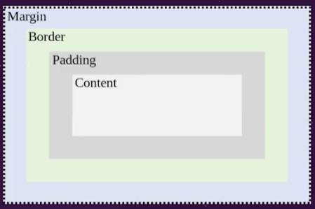

<h1>Entendendo as partes do Box Model</h1>

<strong>Content:</strong> O conteúdo da caixa, onde aparecem textos ou imagens;

<strong>Padding:</strong> Espaçamento ao redor de um conteúdo (seu preenchimento é transparente);

<strong>Border:</strong> Uma borda que fica entre a margin e o padding;

<strong>Margin:</strong> Limpa uma área fora da border (a margem é transparente);

<h2>Exemplo</h2>

